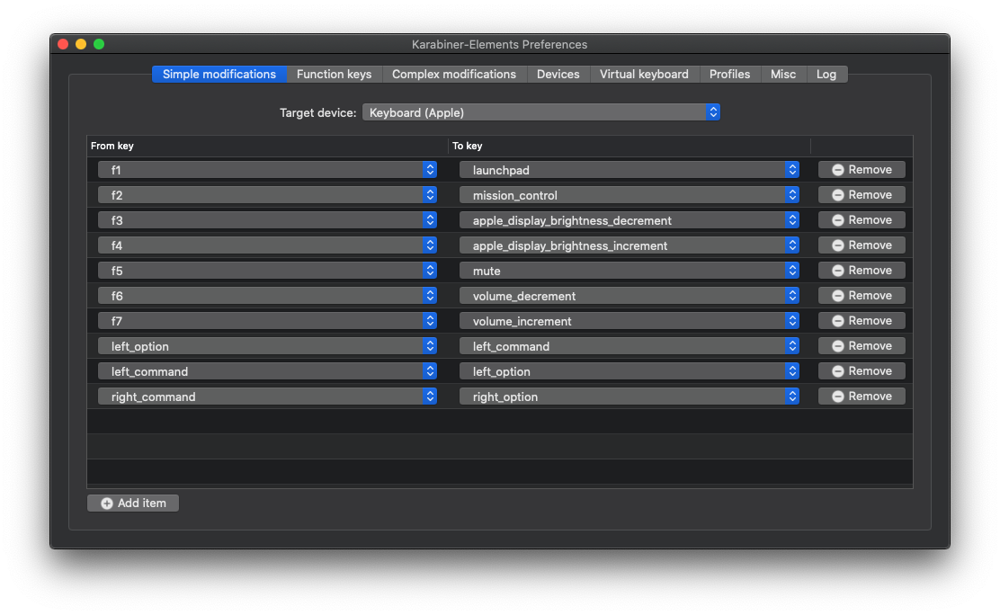

# HP ZBOOK G5 STUDIO EFI

This laptop makes a pretty good hackintosh and supports next to all features, I'm still working on it. It's reliable so far and got good battery life.

# What works

- [x] UHD630 with 2560MB VRAM
- [x] Brightness controls
- [x] USB type A ports (2.0 & 3.0)
- [x] Native NVRAM r/w
- [x] cAVS audio with internal speakers & audio jack
- [x] Intel Bluetooth, able to toggle on/off
- [x] I2C Synaptics trackpad, up to 5 finger gestures
- [x] PS2 keyboard, remappings through karabiner
- [x] Battery management
- [x] USB type C data and video

# What doesn't

- [ ] WiFi (seems very hard)
- [ ] HDMI port (wired to NVIDIA, thus it's dead)
- [ ] Cardreader (sadly PCI and not USB, can't find drivers)
- [ ] Thunderbolt (got no devices to test, but hotplug is not patched yet)

# ToDo

- [ ] Undervolting by 100mv to 150mv

## BIOS settings

Coming soon...

## Key remaps

The PS2 keyboard keys are all messed up, working like that would be a nightmare. Thus, I remapped the following keys, feel free to do so aswell:

